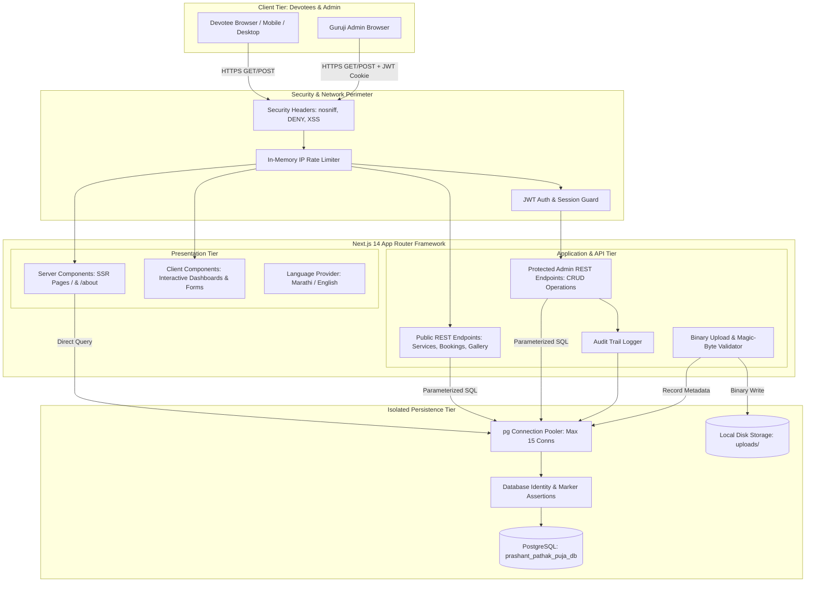
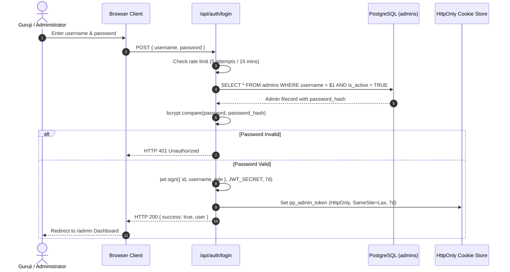
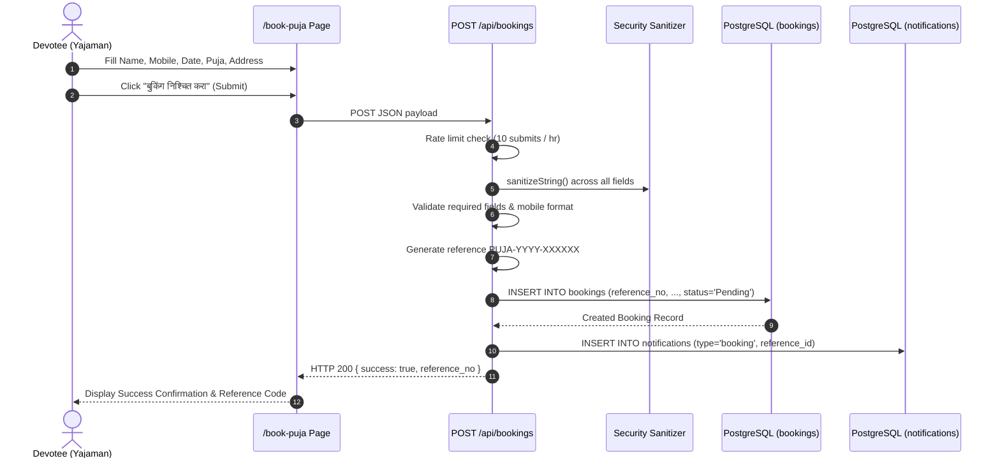

# PROJECT REPORT 03: SYSTEM ARCHITECTURE

---

## 1. Executive Architectural Overview
The **Vedmurti Prashant Shriprasad Pathak (Guruji) Website** is architected as a modern, decoupled monolithic full-stack application utilizing the **Next.js 14 App Router** paradigm coupled with a dedicated **PostgreSQL** relational database. The architecture emphasizes high-performance Server-Side Rendering (SSR) for public discoverability, rapid Client-Side Rendering (CSR) for interactive dashboards, and strict data layer isolation.

---

## 2. Overall System Architecture Diagram



---

## 3. Frontend Architecture
The presentation layer is structured within the Next.js `src/app` directory following the App Router pattern:
- **Server Components (RSC):** Pages such as `src/app/page.tsx` and `src/app/about/page.tsx` execute on the server. They query PostgreSQL directly during request time (`export const dynamic = 'force-dynamic'`), passing hydrated data props to child client components. This completely prevents layout shifts and guarantees that Guruji's official portrait and puja details appear in the initial SSR HTML stream.
- **Client Components ('use client'):** Interactive components (e.g., `HomePageClient.tsx`, `AboutClient.tsx`, `ImageCropModal.tsx`, `LanguageSwitcher.tsx`, and admin pages) manage interactive state, form validation, tab selection, modal toggles, and dynamic translations.
- **State Management:** Local React state (`useState`, `useEffect`) combined with Context API (`LanguageProvider`) manages internationalization state without the overhead of external third-party state libraries.
- **Styling Architecture:** Utility-first styling with **Tailwind CSS v3.4**, configured with custom sacred palette extensions (`saffron-500: #E65100`, `maroon-800: #660F1A`, `gold-400: #D4AF37`, `ivory-100: #FAF7F2`) and typography definitions (`font-serif: Noto Serif Devanagari`).

---

## 4. Backend & API Architecture
The backend application logic is implemented as Next.js Route Handlers (`route.ts`) serving standard JSON REST endpoints:
- **Stateless Controller Pattern:** Each `route.ts` encapsulates request parameter extraction, sanitization, rate-limit evaluation, database querying, audit logging, and structured JSON responses.
- **Strict Separation of Privileges:**
  - Public routes (`/api/services`, `/api/gallery`, `/api/events`, `/api/testimonials`, `/api/faqs`, `/api/profile`, `/api/whatsapp`) allow read operations and rate-limited public submissions.
  - Private routes (`/api/admin/*`, `/api/upload`, `PUT /api/profile`, `/api/audit-logs`) enforce `requireAdmin(req)` verification before executing any operation.

---

## 5. Database Architecture & Isolation Enforcement
The persistence tier utilizes PostgreSQL exclusively. A dedicated connection pool is managed in `src/lib/db.ts`:
- **Identity Safety Assertion:** Every query invocation verifies that:
  $$\text{current\_database}() == \text{'prashant\_pathak\_puja\_db'} \quad \wedge \quad \text{current\_user} == \text{'prashant\_pathak\_app'}$$
- **Application Marker Assertion:** Confirms that the `application_metadata` table contains `application_identifier = 'prashant_pathak_guruji_website'`.
- If any assertion fails, execution immediately throws a fatal exception, preventing any accidental cross-project database interaction.

---

## 6. Authentication Flow



---

## 7. Puja Booking Flow



---

## 8. Media Upload & Interactive Cropping Flow

```mermaid
sequenceDiagram
    autonumber
    actor Admin as Guruji / Admin
    participant ProfilePage as /admin/profile
    participant CropModal as ImageCropModal
    participant UploadAPI as POST /api/upload
    participant Disk as Local File System (uploads/)
    participant MediaTable as PostgreSQL (media)
    participant SettingsTable as PostgreSQL (website_settings)

    Admin->>ProfilePage: Select photo file (.jpg / .png)
    ProfilePage->>CropModal: Open interactive cropping canvas
    Admin->>CropModal: Zoom, pan, adjust aspect ratio (4:5 / 1:1)
    Admin->>CropModal: Click "पीक जतन करा व सेव्ह करा" (Crop & Save)
    CropModal->>UploadAPI: POST FormData(blob, filename) + JWT Cookie
    UploadAPI->>UploadAPI: Verify Admin Auth & Rate Limit
    UploadAPI->>UploadAPI: validateImageMagicBytes(buffer)
    UploadAPI->>UploadAPI: generateSafeFileName(ext)
    UploadAPI->>Disk: fs.writeFileSync(uploads/safeFilename)
    UploadAPI->>MediaTable: INSERT INTO media (filename, url, ...)
    UploadAPI-->>CropModal: HTTP 200 { url: "/api/uploads/..." }
    CropModal->>SettingsTable: PUT /api/profile { hero_image_url: url, ... }
    SettingsTable-->>ProfilePage: HTTP 200 { success: true, profile }
    ProfilePage-->>Admin: Show Success Notification; Photo published!
```

---

## 9. Error Handling & Security Boundaries
1. **Perimeter Layer:** `next.config.mjs` sets rigid HTTP security headers preventing MIME sniffing, iframe clickjacking, and XSS.
2. **Application Boundary:** Centralized try-catch wrappers across all API routes ensure unhandled exceptions log to server stderr while returning sanitized, localized Marathi/English error responses without database stack traces.
3. **Storage Boundary:** The file serving route `/api/uploads/[filename]` strictly enforces regex matching `^[a-zA-Z0-9_-]+\.[a-zA-Z0-9]+$` and path prefixes to prevent path traversal attacks.

---
*System Architecture verified against actual implementation.*
