# PROJECT REPORT 04: DATABASE DESIGN & SCHEMA SPECIFICATION

---

## 1. Database Identification & Isolation Strategy
- **DBMS:** PostgreSQL 14+ (Relational Database Management System)
- **Database Name:** `prashant_pathak_puja_db`
- **Database Owner / App User:** `prashant_pathak_app`
- **Application Identifier:** `prashant_pathak_guruji_website`
- **Connection Host & Port:** `localhost:5432`

### Runtime Database Isolation Guard
The application implements programmatic isolation enforcement in `src/lib/db.ts`. Prior to executing queries, the connection pool runs:
```sql
SELECT current_database() AS db, current_user AS usr;
```
If `db !== 'prashant_pathak_puja_db'` or `usr !== 'prashant_pathak_app'`, the application immediately throws a `[CRITICAL SECURITY HALT]` exception. Additionally, it confirms that `application_metadata.application_identifier` matches `prashant_pathak_guruji_website`.

---

## 2. Entity-Relationship (ER) Diagram

```mermaid
erDiagram
    application_metadata {
        int id PK
        varchar application_name
        varchar application_identifier UK
        varchar schema_version
        timestamptz created_at
        timestamptz updated_at
    }

    admins {
        int id PK
        varchar username UK
        varchar email UK
        varchar password_hash
        varchar full_name
        varchar role
        boolean is_active
        timestamptz created_at
        timestamptz updated_at
    }

    admin_sessions {
        int id PK
        int admin_id FK
        varchar token_hash UK
        varchar ip_address
        text user_agent
        timestamptz expires_at
        timestamptz created_at
    }

    service_categories {
        int id PK
        varchar name_mr
        varchar name_en
        varchar slug UK
        int sort_order
        boolean is_active
        timestamptz created_at
    }

    services {
        int id PK
        varchar slug UK
        varchar name_mr
        varchar name_en
        int category_id FK
        text short_desc_mr
        text short_desc_en
        text detailed_desc_mr
        text detailed_desc_en
        varchar duration
        numeric price
        varchar price_label_mr
        varchar price_label_en
        text materials_mr
        text materials_en
        text procedure_mr
        text procedure_en
        text image_url
        text_array additional_images
        boolean enable_booking
        boolean enable_enquiry
        boolean is_featured
        boolean is_active
        int sort_order
        varchar seo_title
        text meta_desc
        timestamptz created_at
        timestamptz updated_at
    }

    bookings {
        int id PK
        varchar reference_no UK
        int service_id FK
        varchar service_name
        varchar full_name
        varchar mobile
        varchar email
        date preferred_date
        varchar preferred_time
        int people_count
        text address
        varchar area
        varchar city
        varchar pincode
        text message
        varchar status
        text admin_notes
        timestamptz created_at
        timestamptz updated_at
    }

    events {
        int id PK
        varchar title_mr
        varchar title_en
        text description_mr
        text description_en
        date event_date
        varchar event_time
        varchar location
        text image_url
        boolean is_published
        int sort_order
        timestamptz created_at
        timestamptz updated_at
    }

    gallery {
        int id PK
        varchar title_mr
        varchar title_en
        text image_url
        varchar category
        boolean is_featured
        boolean is_hidden
        int sort_order
        timestamptz created_at
        timestamptz updated_at
    }

    media {
        int id PK
        varchar filename UK
        varchar original_name
        varchar mime_type
        int file_size
        int width
        int height
        varchar category
        text url
        timestamptz created_at
    }

    videos {
        int id PK
        varchar title_mr
        varchar title_en
        text youtube_url
        text description_mr
        text description_en
        text thumbnail_url
        boolean is_published
        int sort_order
        timestamptz created_at
        timestamptz updated_at
    }

    testimonials {
        int id PK
        varchar author_name_mr
        varchar author_name_en
        varchar location_mr
        varchar location_en
        int rating
        text comment_mr
        text comment_en
        boolean is_approved
        timestamptz created_at
        timestamptz updated_at
    }

    blog_posts {
        int id PK
        varchar slug UK
        varchar title_mr
        varchar title_en
        text excerpt_mr
        text excerpt_en
        text content_mr
        text content_en
        text featured_image
        varchar category
        boolean is_published
        timestamptz published_at
        timestamptz created_at
        timestamptz updated_at
    }

    faqs {
        int id PK
        text question_mr
        text question_en
        text answer_mr
        text answer_en
        varchar category
        int sort_order
        boolean is_published
        timestamptz created_at
        timestamptz updated_at
    }

    website_settings {
        int id PK
        varchar guruji_name_mr
        varchar guruji_name_en
        varchar guruji_title_mr
        varchar guruji_title_en
        text bio_mr
        text bio_en
        text hero_image_url
        text primary_photo_url
        text about_photo_url
        varchar contact_location_mr
        varchar contact_location_en
        varchar whatsapp_username
        varchar appearance_primary_color
        varchar appearance_secondary_color
        varchar appearance_accent_color
        varchar appearance_background
        varchar appearance_text
        varchar appearance_button_style
        text logo_url
        text favicon_url
        timestamptz updated_at
    }

    homepage_sections {
        int id PK
        varchar section_key UK
        varchar title_mr
        varchar title_en
        text subtitle_mr
        text subtitle_en
        boolean is_enabled
        int sort_order
        jsonb config_json
        timestamptz updated_at
    }

    notifications {
        int id PK
        varchar title_mr
        varchar title_en
        text message_mr
        text message_en
        varchar type
        boolean is_read
        varchar reference_id
        timestamptz created_at
    }

    audit_logs {
        int id PK
        int admin_id
        varchar admin_username
        varchar action
        varchar entity
        varchar entity_id
        jsonb details
        varchar ip_address
        timestamptz created_at
    }

    admins ||--o{ admin_sessions : owns
    service_categories ||--o{ services : classifies
    services ||--o{ bookings : requested_for
```



---

## 3. Detailed Table Dictionary (All 17 Entities)

### 3.1 `application_metadata`
Stores the unique safety marker and schema version for runtime database verification.
- `id` (SERIAL PRIMARY KEY)
- `application_name` (VARCHAR(100) NOT NULL)
- `application_identifier` (VARCHAR(100) NOT NULL UNIQUE)
- `schema_version` (VARCHAR(20) NOT NULL)
- `created_at`, `updated_at` (TIMESTAMPTZ DEFAULT CURRENT_TIMESTAMP)

### 3.2 `admins`
Stores authenticated administrative accounts.
- `id` (SERIAL PRIMARY KEY)
- `username` (VARCHAR(50) NOT NULL UNIQUE)
- `email` (VARCHAR(100) NOT NULL UNIQUE)
- `password_hash` (VARCHAR(255) NOT NULL) — Salted bcrypt hash
- `full_name` (VARCHAR(100) NOT NULL)
- `role` (VARCHAR(20) DEFAULT 'admin')
- `is_active` (BOOLEAN DEFAULT TRUE)
- `created_at`, `updated_at` (TIMESTAMPTZ)

### 3.3 `admin_sessions`
Tracks active token sessions.
- `id` (SERIAL PRIMARY KEY)
- `admin_id` (INTEGER REFERENCES admins(id) ON DELETE CASCADE)
- `token_hash` (VARCHAR(255) NOT NULL UNIQUE)
- `ip_address` (VARCHAR(45))
- `user_agent` (TEXT)
- `expires_at` (TIMESTAMPTZ NOT NULL)
- `created_at` (TIMESTAMPTZ)

### 3.4 `service_categories`
Classification taxonomy for Vedic ceremonies.
- `id` (SERIAL PRIMARY KEY)
- `name_mr`, `name_en` (VARCHAR(100) NOT NULL)
- `slug` (VARCHAR(100) NOT NULL UNIQUE)
- `sort_order` (INTEGER DEFAULT 0)
- `is_active` (BOOLEAN DEFAULT TRUE)
- `created_at` (TIMESTAMPTZ)

### 3.5 `services`
Catalog of Vedic pujas and rituals.
- `id` (SERIAL PRIMARY KEY)
- `slug` (VARCHAR(100) NOT NULL UNIQUE)
- `name_mr`, `name_en` (VARCHAR(150) NOT NULL)
- `category_id` (INTEGER REFERENCES service_categories(id) ON DELETE SET NULL)
- `short_desc_mr`, `short_desc_en` (TEXT NOT NULL)
- `detailed_desc_mr`, `detailed_desc_en` (TEXT NOT NULL)
- `duration` (VARCHAR(50))
- `price` (NUMERIC(10,2) DEFAULT NULL)
- `price_label_mr`, `price_label_en` (VARCHAR(100))
- `materials_mr`, `materials_en` (TEXT)
- `procedure_mr`, `procedure_en` (TEXT)
- `image_url` (TEXT)
- `additional_images` (TEXT[] DEFAULT '{}')
- `enable_booking`, `enable_enquiry`, `is_featured`, `is_active` (BOOLEAN)
- `sort_order` (INTEGER DEFAULT 0)
- `seo_title` (VARCHAR(200)), `meta_desc` (TEXT)
- `created_at`, `updated_at` (TIMESTAMPTZ)

### 3.6 `bookings`
Devotee puja inquiries and scheduled ceremonies.
- `id` (SERIAL PRIMARY KEY)
- `reference_no` (VARCHAR(50) NOT NULL UNIQUE)
- `service_id` (INTEGER REFERENCES services(id) ON DELETE SET NULL)
- `service_name` (VARCHAR(150) NOT NULL)
- `full_name` (VARCHAR(100) NOT NULL)
- `mobile` (VARCHAR(20) NOT NULL)
- `email` (VARCHAR(100))
- `preferred_date` (DATE NOT NULL)
- `preferred_time` (VARCHAR(50) NOT NULL)
- `people_count` (INTEGER)
- `address` (TEXT NOT NULL), `area` (VARCHAR(100)), `city` (VARCHAR(100) DEFAULT 'Nagpur'), `pincode` (VARCHAR(10))
- `message` (TEXT)
- `status` (VARCHAR(20) DEFAULT 'Pending' CHECK (status IN ('Pending', 'Confirmed', 'Completed', 'Cancelled')))
- `admin_notes` (TEXT)
- `created_at`, `updated_at` (TIMESTAMPTZ)

### 3.7 `events`
Upcoming religious festivals and Muhurats.
- `id` (SERIAL PRIMARY KEY)
- `title_mr`, `title_en` (VARCHAR(200) NOT NULL)
- `description_mr`, `description_en` (TEXT NOT NULL)
- `event_date` (DATE NOT NULL)
- `event_time` (VARCHAR(50)), `location` (VARCHAR(200)), `image_url` (TEXT)
- `is_published` (BOOLEAN DEFAULT TRUE), `sort_order` (INTEGER DEFAULT 0)
- `created_at`, `updated_at` (TIMESTAMPTZ)

### 3.8 `gallery`
Curated photo gallery entries.
- `id` (SERIAL PRIMARY KEY)
- `title_mr`, `title_en` (VARCHAR(200))
- `image_url` (TEXT NOT NULL)
- `category` (VARCHAR(100) DEFAULT 'पूजा')
- `is_featured`, `is_hidden` (BOOLEAN)
- `sort_order` (INTEGER DEFAULT 0)
- `created_at`, `updated_at` (TIMESTAMPTZ)

### 3.9 `media`
Internal media asset index.
- `id` (SERIAL PRIMARY KEY)
- `filename` (VARCHAR(255) NOT NULL UNIQUE)
- `original_name` (VARCHAR(255) NOT NULL)
- `mime_type` (VARCHAR(50) NOT NULL)
- `file_size` (INTEGER NOT NULL), `width`, `height` (INTEGER)
- `category` (VARCHAR(100) DEFAULT 'general')
- `url` (TEXT NOT NULL)
- `created_at` (TIMESTAMPTZ)

### 3.10 `videos`
Embedded spiritual video resources.
- `id` (SERIAL PRIMARY KEY)
- `title_mr`, `title_en` (VARCHAR(200) NOT NULL)
- `youtube_url` (TEXT NOT NULL)
- `description_mr`, `description_en` (TEXT)
- `thumbnail_url` (TEXT)
- `is_published` (BOOLEAN DEFAULT TRUE), `sort_order` (INTEGER DEFAULT 0)
- `created_at`, `updated_at` (TIMESTAMPTZ)

### 3.11 `testimonials`
Devotee experiences and reviews.
- `id` (SERIAL PRIMARY KEY)
- `author_name_mr`, `author_name_en` (VARCHAR(100) NOT NULL)
- `location_mr`, `location_en` (VARCHAR(100))
- `rating` (INTEGER DEFAULT 5 CHECK (rating >= 1 AND rating <= 5))
- `comment_mr`, `comment_en` (TEXT NOT NULL)
- `is_approved` (BOOLEAN DEFAULT TRUE)
- `created_at`, `updated_at` (TIMESTAMPTZ)

### 3.12 `blog_posts`
Educational Vedic articles and explanations.
- `id` (SERIAL PRIMARY KEY)
- `slug` (VARCHAR(150) NOT NULL UNIQUE)
- `title_mr`, `title_en` (VARCHAR(250) NOT NULL)
- `excerpt_mr`, `excerpt_en` (TEXT)
- `content_mr`, `content_en` (TEXT NOT NULL)
- `featured_image` (TEXT), `category` (VARCHAR(100) DEFAULT 'धार्मिक माहिती')
- `is_published` (BOOLEAN DEFAULT TRUE), `published_at` (TIMESTAMPTZ)
- `created_at`, `updated_at` (TIMESTAMPTZ)

### 3.13 `faqs`
Frequently asked questions and answers.
- `id` (SERIAL PRIMARY KEY)
- `question_mr`, `question_en` (TEXT NOT NULL)
- `answer_mr`, `answer_en` (TEXT NOT NULL)
- `category` (VARCHAR(100) DEFAULT 'सामान्य')
- `sort_order` (INTEGER DEFAULT 0), `is_published` (BOOLEAN DEFAULT TRUE)
- `created_at`, `updated_at` (TIMESTAMPTZ)

### 3.14 `website_settings`
Singleton configuration table (enforced via `CHECK (id = 1)`).
- `id` (INTEGER PRIMARY KEY DEFAULT 1)
- `guruji_name_mr`, `guruji_name_en` (VARCHAR(150))
- `guruji_title_mr`, `guruji_title_en` (VARCHAR(200))
- `bio_mr`, `bio_en` (TEXT NOT NULL)
- `hero_image_url`, `primary_photo_url`, `about_photo_url` (TEXT)
- `contact_location_mr`, `contact_location_en` (VARCHAR(200))
- `whatsapp_username` (VARCHAR(100) DEFAULT '@PrashantPathakGuruji')
- `appearance_primary_color`, `appearance_secondary_color`, `appearance_accent_color`, `appearance_background`, `appearance_text`, `appearance_button_style` (VARCHAR(20))
- `logo_url`, `favicon_url` (TEXT)
- `updated_at` (TIMESTAMPTZ)

### 3.15 `homepage_sections`
Homepage section ordering and visibility control.
- `id` (SERIAL PRIMARY KEY)
- `section_key` (VARCHAR(50) NOT NULL UNIQUE)
- `title_mr`, `title_en` (VARCHAR(150))
- `subtitle_mr`, `subtitle_en` (TEXT)
- `is_enabled` (BOOLEAN DEFAULT TRUE), `sort_order` (INTEGER DEFAULT 0)
- `config_json` (JSONB DEFAULT '{}'::jsonb)
- `updated_at` (TIMESTAMPTZ)

### 3.16 `notifications`
In-app alerts for administrators.
- `id` (SERIAL PRIMARY KEY)
- `title_mr`, `title_en` (VARCHAR(200) NOT NULL)
- `message_mr`, `message_en` (TEXT NOT NULL)
- `type` (VARCHAR(50) DEFAULT 'booking')
- `is_read` (BOOLEAN DEFAULT FALSE)
- `reference_id` (VARCHAR(50))
- `created_at` (TIMESTAMPTZ)

### 3.17 `audit_logs`
Immutable administrative audit log.
- `id` (SERIAL PRIMARY KEY)
- `admin_id` (INTEGER), `admin_username` (VARCHAR(50))
- `action` (VARCHAR(100) NOT NULL), `entity` (VARCHAR(100) NOT NULL), `entity_id` (VARCHAR(100))
- `details` (JSONB)
- `ip_address` (VARCHAR(45))
- `created_at` (TIMESTAMPTZ)

---

## 4. Performance Indexes
The schema defines 11 explicit B-tree indexes for fast queries:
1. `idx_services_slug` on `services(slug)`
2. `idx_services_category` on `services(category_id)`
3. `idx_services_active` on `services(is_active)`
4. `idx_bookings_ref` on `bookings(reference_no)`
5. `idx_bookings_status` on `bookings(status)`
6. `idx_bookings_date` on `bookings(preferred_date)`
7. `idx_gallery_featured` on `gallery(is_featured)`
8. `idx_events_date` on `events(event_date)`
9. `idx_blog_slug` on `blog_posts(slug)`
10. `idx_notifications_read` on `notifications(is_read)`
11. `idx_audit_created` on `audit_logs(created_at)`

---

## 5. Seed Data & Initialization
Database initialization is managed via `scripts/init-db.mjs`. It seeds:
- Application metadata marker (`prashant_pathak_guruji_website`).
- Initial administrator account (`admin`).
- Baseline Guruji biographical profile and WhatsApp handle.
- 6 Service Categories (`grah-vastu-shanti`, `puja-abhishek`, `sanskar`, etc.).
- 14 Vedic Puja service profiles (Vastu Shanti, Grah Shanti, Satyanarayan, Rudra Abhishek, etc.).
- 10 Homepage section toggles.
- Baseline FAQs and approved devotee testimonials.

---
*Database design specification verified against live PostgreSQL schema.*
