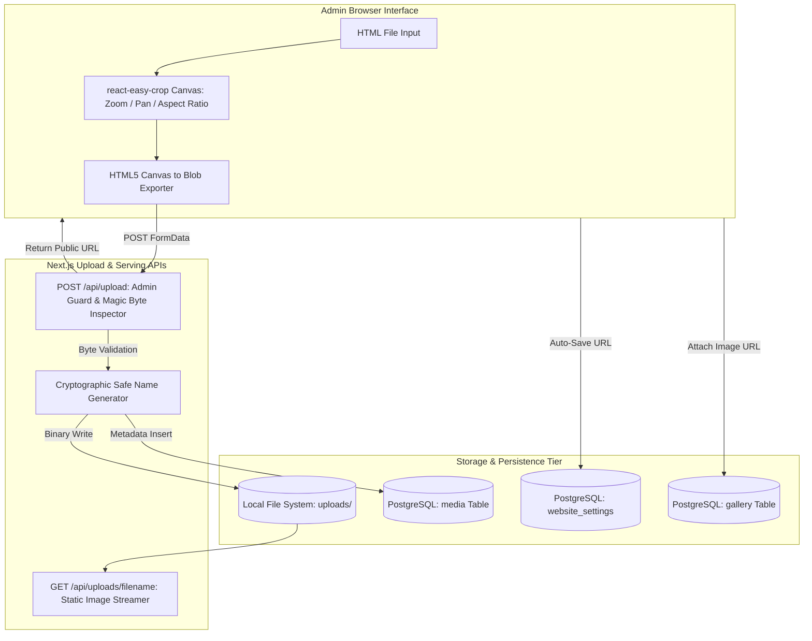

# PROJECT REPORT 10: IMAGE & MEDIA MANAGEMENT ARCHITECTURE

---

## 1. Executive Summary
The **Vedmurti Prashant Shriprasad Pathak (Guruji) Website** features an integrated media subsystem designed for uploading, validating, cataloging, cropping, and serving high-resolution ritual photographs and official portraits of Guruji.

---

## 2. Media Architecture Diagram



---

## 3. Implemented Capabilities & Components

### 3.1 Guruji Portrait & Hero Image Management (`/admin/profile`)
- **Dedicated Target Fields:**
  1. `hero_image_url`: Rendered prominently on the public homepage hero banner.
  2. `primary_photo_url`: Primary portrait used across promotional badges.
  3. `about_photo_url`: Displayed in the Guruji biography card on the `/about` page.
- **Interactive Cropping Canvas (`ImageCropModal.tsx`):**
  - Powered by `react-easy-crop` (v5.2.0).
  - Supports interactive multi-touch pinch-to-zoom and mouse-wheel zoom.
  - Interactive pan/repositioning.
  - Aspect ratio toggle: Portrait (`4:5`) for devotional cards, Square (`1:1`) for medallions.
  - Generates optimized output Blob directly in memory via an HTML5 canvas context.
- **Instant Persistence:** Upon clicking "पीक जतन करा व सेव्ह करा" (Crop & Save), the modal uploads the cropped image blob and automatically persists the returned URL to `/api/profile` via `PUT`, updating the database immediately.

### 3.2 Media Library (`/admin/media`, `media` table)
- Central repository listing all uploaded image assets with filename, original name, MIME type, file size, thumbnail preview, and upload timestamp.
- Direct URL copy to clipboard.
- Single-click asset deletion with audit log generation.

### 3.3 Photo Gallery Curation (`/admin/gallery`, `/gallery`)
- Manages ritual gallery items with category tags (e.g., `पूजा`, `वास्तु`, `विधी`).
- Toggles: `is_featured` (controls display on the public homepage) and `is_hidden` (suppresses image without deletion).
- Public Lightbox: Client-side modal overlay providing full-screen image inspection with backdrop dismissal.

---

## 4. File Validation & Storage Security

### 4.1 Strict Magic-Byte Binary Inspection
The system completely rejects file extension spoofing. In `src/lib/security.ts`:
```typescript
export function validateImageMagicBytes(buffer: Buffer): { valid: boolean; ext: string | null } {
  // JPEG: FF D8 FF
  if (buffer[0] === 0xff && buffer[1] === 0xd8 && buffer[2] === 0xff) return { valid: true, ext: 'jpg' };
  // PNG: 89 50 4E 47 0D 0A 1A 0A
  if (buffer[0] === 0x89 && buffer[1] === 0x50 && buffer[2] === 0x4e && buffer[3] === 0x47) return { valid: true, ext: 'png' };
  // WebP: 'RIFF' .... 'WEBP'
  if (buffer[0] === 0x52 && buffer[8] === 0x57 && buffer[11] === 0x50) return { valid: true, ext: 'webp' };
  return { valid: false, ext: null };
}
```

### 4.2 Size & Name Security
- **Max File Size:** Enforced strictly at 10 MB (`10 * 1024 * 1024` bytes).
- **Safe Filename Generation:** Generates non-guessable, sanitized filenames:
  $$\text{SafeName} = \text{Date.now}() + \text{"\_"} + \text{crypto.randomBytes}(16).\text{toString}('hex') + \text{"."} + \text{ext}$$
- **Path Traversal Protection:** Validates that all file writes and reads are bounded within `path.join(process.cwd(), 'uploads')`.

---
*Media management documentation verified against `ImageCropModal.tsx` and upload handlers.*
