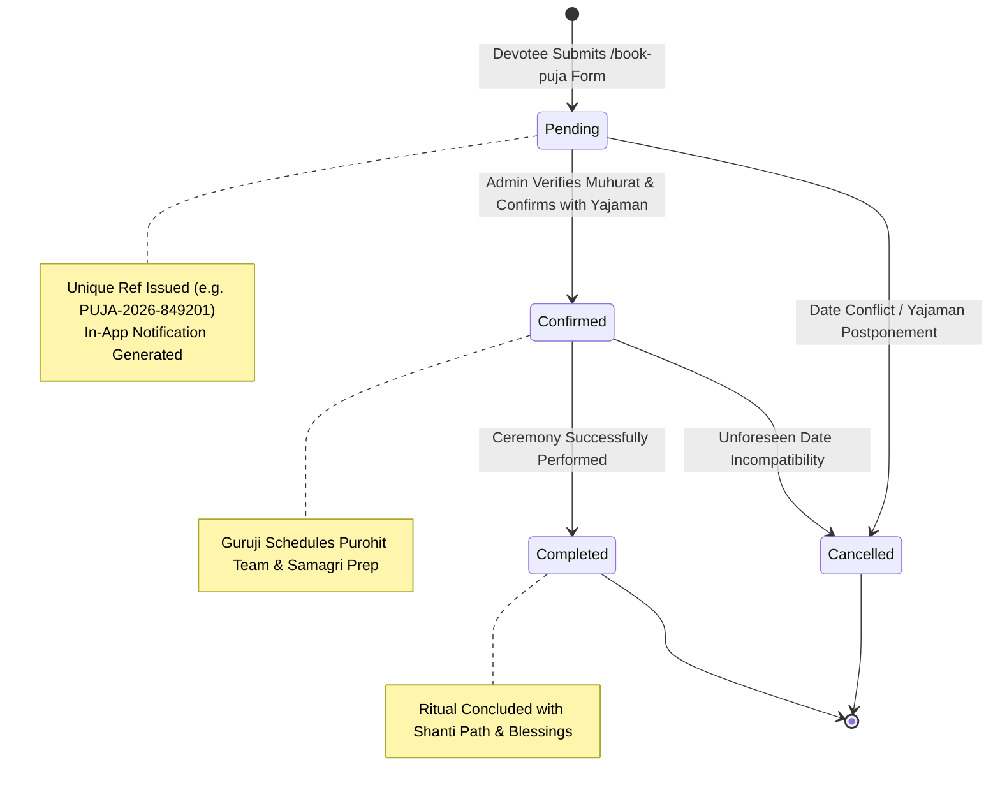

# PROJECT REPORT 11: PUJA BOOKING & INQUIRY SYSTEM ARCHITECTURE

---

## 1. Executive Summary
The **Puja Booking & Inquiry System** enables devotees (Yajamans) to submit structured, formal requests for Vedic ceremonies while providing Guruji with an organized administrative back-office to review, confirm, annotate, and track ceremonies through their complete operational lifecycle.

---

## 2. Booking Lifecycle State Diagram



---

## 3. Public Booking Form Specification (`/book-puja`)

### 3.1 Field Capture & Schema Validation
The public booking form captures comprehensive details required for ceremonial planning:

| Field Name | Type | Required | Validation Rule | Purpose |
| :--- | :--- | :--- | :--- | :--- |
| `service_id` | Select / Integer | Optional | Must exist in `services` | Specific puja selected |
| `service_name` | Text | Required | Sanitized string | Ceremony name fallback |
| `full_name` | Text | **Yes** | Min 2 characters | Name of Yajaman / Host |
| `mobile` | Tel | **Yes** | `^[0-9+ -]{8,15}$` | Primary contact telephone |
| `email` | Email | Optional | Valid email format | Confirmation contact |
| `preferred_date`| Date | **Yes** | Valid calendar date | Expected Muhurat date |
| `preferred_time`| Select / Text | **Yes** | Morning / Afternoon / Evening | Desired time slot |
| `people_count` | Number | Optional | Positive integer | Estimated attendees |
| `address` | Textarea | **Yes** | Min 5 characters | Complete venue address |
| `area` | Text | Optional | Sanitized string | Neighborhood / Colony |
| `city` | Text | **Yes** | Default: 'Nagpur' | Host city |
| `pincode` | Text | Optional | Standard postal code | Postal routing |
| `message` | Textarea | Optional | Sanitized string | Specific Gotra / notes |

### 3.2 Unique Reference Number Generation Algorithm
Every valid booking submission triggers algorithmic generation of a standardized reference identifier in `src/lib/security.ts`:
```typescript
export function generateBookingReference(): string {
  const year = new Date().getFullYear();
  const randomNum = Math.floor(100000 + Math.random() * 900000);
  return `PUJA-${year}-${randomNum}`;
}
```
*Example Generated Reference:* `PUJA-2026-849201`.

### 3.3 Devotee Confirmation View
Upon successful processing:
- The form transitions to a confirmation screen.
- Displays the generated reference number.
- Reassures the devotee that Guruji will personally contact them via phone or WhatsApp to coordinate Muhurat timings and Samagri details.

---

## 4. Administrative Booking Workflow (`/admin/bookings`)

### 4.1 Search, Filter & Pagination
- **Status Filter:** Instant filtering by tabs: `All`, `Pending`, `Confirmed`, `Completed`, `Cancelled`.
- **Search Engine:** Real-time ILIKE query across devotee full name, booking reference number, mobile number, city, and service name.
- **Server Pagination:** Managed with `page` and `limit` query parameters with total count calculations.

### 4.2 Status Transitions & Administrative Notes
- Administrators can transition any booking record between lifecycle states (`Pending` $\rightarrow$ `Confirmed` $\rightarrow$ `Completed` $\rightarrow$ `Cancelled`).
- Custom internal notes can be recorded (e.g., *"Confirmed for 7:30 AM Muhurat at Dharampeth residence; Guruji will bring preliminary Puja Samagri"*).
- Every status update automatically logs an audit trail record in `audit_logs` linking the administrator's ID and IP address.

---

## 5. Security & Privacy Safeguards
1. **Public Information Isolation:** The `GET /api/bookings` route is strictly protected with `requireAdmin(req)`. Public visitors cannot list, view, search, or scrape bookings.
2. **Submission Rate Limiting:** Enforces an in-memory limit of 10 submissions per hour per IP address to prevent denial-of-service spam.
3. **Automated Notification Integration:** Inserts an alert record into `notifications` upon booking creation, updating the admin dashboard unread badge in real time.

---
*Booking system documentation verified against `src/app/book-puja` and `src/app/api/bookings`.*
